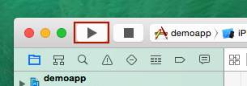

circuit-sdk-ios-deeplink-demo
===================

iOS向けCircuit SDK用サンプルアプリのリポジトリです。

ECサイトの振舞いを模したアプリであり、  
Circuit SDKの導入前/導入後の状態をブランチ分けして用意しています。  
それらのコードをご覧いただき、Circuit SDK導入の参考にご利用ください。  

#### ブランチ
* master     :Circuit SDKを未導入状態のブランチとなります。
* use-circuit:Circuit SDKを導入済み状態のブランチとなります。

####　build手順
##### Circuit SDK未導入
1-1. `git clone git@github.com:FukurouLabo/circuit-sdk-ios-deeplink-demo.git`  
1-2. `demoapp.xcodeproj`を開く  
1-3. buildボタンをおす(下記画像)  

##### Circuit SDK導入済み
2-1. 1-1後に `git checkout -b use-circuit`  
2-2. `git pull origin use-circuit`  
2-3. `pod install`  
2-4. `demoapp.xcworkspace`を開く  
2-5. buildボタンをおす(下記画像)  

#### ディープリンク
* 商品詳細ページ:circuitdemo://deepLinkItemId/{商品番号(1 ~ 3)}
* 設定ページ    :circuitdemo://deepLinkClass

### Circuitサイト
* トップページ :http://www.cir.io/
* ドキュメント :https://developer.cir.io/doc/cds
* FAQ          :https://developer.cir.io/faq/cds

### Licence
The source code is released under Apache 2.0.

